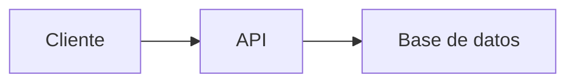

# 📚 Estudio de Roles Básicos en Desarrollo Web y Móvil

##  Recurso Usen el Link odicial para aprender git /github Todos 
https://docs.github.com/es/get-started/start-your-journey/git-and-github-learning-resources
## 0) Integrantes del equipo de estudio y sus responsabilidades en el repositorio *(actualizar)*


1. Linares Taco Viviana Flobele vlinares@unsa.edu.pe
2. Mendoza Larico Delaney Dariana dmendozala@unsa.edu.pe
3. María
4. Motta Medina, Brayan Teodoro - bmottam@unsa.edu.pe
5. Molina soncco, Percy - pmolinaso@unsa.edu.pe
6. David Jose Luis Mendoza Taco - dmendozat@unsa.edu.pe
7. Quispe Balcon Martha Beatriz - mquispebal@unsa.edu.pe
8. Valdivia Flores Manuel Djins - mvaldiviaf@unsa.edu.pe
9. Cruz Kana Pamela Greis - pcruzk@unsa.edu.pe 
12. 

## 1) Conceptos Generales para tener en cuenta
En el contexto de desarrollo web y móvil: diferencias entre librerías, frameworks y patrones de diseño.

## 2) Conociendo Git
Describiremos cómo nos sirve localmente para poder versionar nuestro software.

## 3) Conociendo Github  
- Describiendo el uso de repositorio remoto  
- Cómo definimos repositorio  
- Cómo configurar para permitir al equipo colaborar  
- Supervisión de posibles conflictos  

### Temas a desarrollar por los miembros del Equipo:  
**Roles básicos en el desarrollo de aplicaciones web y aplicación móvil**

## 4) Desarrollador Frontend
- Crea interfaces atractivas y responsivas (adaptables a distintos dispositivos), garantizar una buena experiencia de usuario (UX/UI), conectar con el backend mediante APIs para mostrar datos dinámicos, y optimizar el rendimiento y accesibilidad de la web. 
- Se requiere conocimientos HTML5, CSS3, JavaScript (ES6+), React, Git, Responsive Design, APIs REST, Webpack, TypeScript, Testing (Jest/Cypress), Accesibilidad (WCAG).
- Relación con roles de backend, QA, Desarrollador Android  
- Stack tecnológico:  
  - HTML,CSS,Java Script  
  - Frameworks  

## 5) Links recomendados para capacitación Rol Frontend
*(Separados por criterios)*  
🔹 **Sin certificaciones**:  
- MDN Web Docs: La referencia oficial para HTML, CSS, JavaScript. Imprescindible. https://developer.mozilla.org/en-US/docs/Web

- freeCodeCamp: Cursos interactivos y proyectos prácticos. https://www.freecodecamp.org/

- The Odin Project: Currículo completo y basado en proyectos. https://www.theodinproject.com/

- CSS-Tricks: Blog y recursos detallados sobre CSS y web. https://css-tricks.com/

- JavaScript.info: Tutorial exhaustivo de JavaScript. https://javascript.info/
    
🔹 **Con certificación**:  
- Coursera: Cursos y especializaciones de universidades/empresas (ej: Meta Front-End Developer). https://www.coursera.org/

- edX: Cursos de universidades de prestigio (ej: CS50 Web Programming). https://www.edx.org/

- Udemy: Amplia variedad de cursos individuales (busca los mejor valorados). https://www.udemy.com/

- Platzi: Rutas de aprendizaje completas (Escuela de Desarrollo Web, JavaScript, React.js). https://platzi.com/
    
🔹 **Proyectos completos de ejemplo**:  
- Frontend Mentor: Desafíos de diseño para codificar. https://www.frontendmentor.io/

- GreatFrontEnd: Colección de desafíos de codificación y preguntas de entrevista. https://www.greatfrontend.com/

- GitHub: Explora repositorios con proyectos ("awesome-frontend", "react-projects"). https://github.com/

- CodePen: Entorno online para prototipar y compartir código. https://codepen.io/

🔹 **Recomendadas por líderes (Microsoft, AWS, Google)**:  
- Google Developers (web.dev): Guías de rendimiento web y herramientas. https://web.dev/

- Microsoft Learn: Rutas de aprendizaje sobre HTML, CSS, JS, React, Angular. https://learn.microsoft.com/en-us/

- AWS Amplify Docs: Tutoriales para integrar Frontend con la nube. https://aws.amazon.com/amplify/

- React.dev (Meta): Documentación oficial del framework React. https://react.dev/

## 6) Desarrollador Backend
💡 ¿Qué es el Backend?
El backend es la parte del desarrollo web que gestiona la lógica, bases de datos y servidores. Es lo que el usuario no ve, pero permite que todo funcione correctamente en una aplicación o sitio web.

Por ejemplo, cuando haces login en una página, el backend valida tus credenciales, accede a la base de datos y devuelve una respuesta al frontend.

🧱 Componentes del Backend
Servidor: Máquina (física o en la nube) que ejecuta la lógica del sistema.

Aplicación backend: Código que maneja la lógica de negocio (por ejemplo: Node.js, Java, Python).

Base de datos: Sistema para almacenar datos persistentes (MySQL, MongoDB, PostgreSQL).

API: Interfaz para que otras aplicaciones (por ejemplo, el frontend) se comuniquen con el backend.

Autenticación y autorización: Controlan el acceso de los usuarios a los recursos.

🛠️ Tecnologías Backend populares
Lenguajes de programación:
JavaScript (Node.js)

Python (Django, Flask)

Java (Spring Boot)

PHP (Laravel, Symfony)

Ruby (Ruby on Rails)

Go y Rust (más modernos, usados en microservicios)

Bases de datos:
Relacionales: MySQL, PostgreSQL, SQLite

NoSQL: MongoDB, Redis, Cassandra

Frameworks:
Node.js con Express.js

Django (Python)

Spring Boot (Java)

Laravel (PHP)

FastAPI (Python, muy rápido y moderno)

Herramientas DevOps (usadas en backend):
Docker, Kubernetes, Nginx

CI/CD: Jenkins, GitHub Actions

Control de versiones: Git

📡 ¿Qué hace un desarrollador Backend?
Un desarrollador backend:

Diseña la estructura de datos y modelos.

Crea API RESTful o GraphQL.

Implementa lógica del negocio.

Administra bases de datos.

Asegura seguridad y autenticación.

Optimiza el rendimiento del servidor.

Colabora con frontend y DevOps.

🔐 Temas importantes en backend
Autenticación (JWT, OAuth2, sesiones)

Autorización de roles

Manejo de errores y excepciones

Pruebas (unitarias y de integración)

Manejo de archivos

Sockets y WebSockets (para tiempo real)

Trabajo con colas (RabbitMQ, Kafka)

Middlewares

Seguridad: CORS, XSS, CSRF, encriptación

🧩 Arquitecturas comunes
Monolítica: Todo el backend en un solo sistema.

Microservicios: El backend se divide en pequeños servicios independientes.

Serverless: Código backend que corre bajo demanda (ej: AWS Lambda).

MVC (Modelo-Vista-Controlador): Patrón común para estructurar el código.

🌐 Backend y APIs
El backend generalmente expone una API para que el frontend o clientes móviles puedan hacer peticiones HTTP (GET, POST, PUT, DELETE). Por ejemplo:

h
Copiar
Editar
GET /api/users
POST /api/login
📈 Salidas profesionales
Con conocimientos de backend puedes trabajar como:

Backend Developer

Full Stack Developer

DevOps Engineer (si aprendes despliegue)

Cloud Engineer

Arquitecto de Software

🧪 Recomendaciones para aprender backend
Aprende un lenguaje base: JavaScript (Node.js) o Python son ideales para empezar.

Usa un framework popular: Express.js, Django, Laravel, etc.

Conecta con una base de datos (MySQL o MongoDB).

Crea un API RESTful simple.

Aprende sobre autenticación con JWT o sesiones.

Prueba tu API con Postman o curl.

Sube tu app a la nube (Heroku, Vercel, Render, AWS).

## 7) Links recomendados para capacitación Rol Backend
🔹 Sin certificaciones (gratuitos, prácticos)
freeCodeCamp (APIs y microservicios)
https://www.freecodecamp.org/learn/back-end-development-and-apis/

MDN Web Docs (HTTP, servidores, etc.)
https://developer.mozilla.org/en-US/docs/Web/HTTP

Backend Developer Roadmap
https://roadmap.sh/backend

Node.js Tutorial
https://nodejs.dev/en/learn/

🔹 Con certificación
Coursera (Meta, IBM, etc.)
https://www.coursera.org/

edX (Harvard, MIT, etc.)
https://www.edx.org/learn/backend-development

Udemy – Cursos como Node.js, Java Spring Boot, Django
https://www.udemy.com/

🔹 Proyectos completos de ejemplo
Node.js Bootcamp (GitHub)
https://github.com/Mohammed-Taysser/Nodejs-Bootcamp

The Odin Project – Backend Node.js
https://www.theodinproject.com/paths/full-stack-javascript

App Ideas Collection (para portafolio)
https://github.com/florinpop17/app-ideas

🔹 Recomendadas por líderes (Microsoft, AWS, Google)
Microsoft Learn (C#, .NET, Azure)
https://learn.microsoft.com/en-us/training/

AWS Backend con Serverless & Lambda
https://explore.skillbuilder.aws/

Google Cloud Skills Boost (Backends escalables)
https://www.cloudskillsboost.google/


## 8) Rol QA
**QA** o **Quality Assurance** (Aseguramiento de la Calidad) es una disciplina fundamental en el desarrollo de software que se encarga de garantizar que los productos cumplan con los estándares de calidad establecidos antes de llegar al usuario final.
# ¿Qué hace un QA?

Un profesional de QA actúa como el **guardián de la calidad**, siendo responsable de identificar defectos, inconsistencias y problemas de usabilidad en aplicaciones, sistemas web, móviles o software en general. Su trabajo va más allá de simplemente "encontrar bugs"; se trata de asegurar que el producto funcione correctamente bajo diferentes condiciones y escenarios.

## Responsabilidades Principales

**Planificación de Pruebas:** Diseña estrategias de testing basadas en los requisitos del proyecto, creando casos de prueba detallados que cubran diferentes funcionalidades y escenarios de uso.

**Ejecución de Pruebas:** Realiza pruebas manuales y automatizadas, verificando que cada componente del software opere según lo esperado. Esto incluye pruebas funcionales, de rendimiento, de seguridad y de usabilidad.

**Documentación:** Registra detalladamente los defectos encontrados, proporcionando información precisa sobre cómo reproducir los problemas para facilitar su corrección por parte del equipo de desarrollo.

**Colaboración Cross-funcional:** Trabaja estrechamente con desarrolladores, product managers y diseñadores para comprender los requisitos y asegurar que se implementen correctamente.
## Tipos de Pruebas que Realiza

El QA maneja diferentes niveles de testing: pruebas unitarias (componentes individuales), pruebas de integración (interacción entre módulos), pruebas de sistema (funcionalidad completa) y pruebas de aceptación (validación final con criterios de negocio).
También se especializa en pruebas específicas como testing de APIs, pruebas de regresión para verificar que nuevas funcionalidades no rompan las existentes, y pruebas de compatibilidad across diferentes navegadores, dispositivos y sistemas operativos.
## Herramientas y Metodologías
Los profesionales de QA utilizan herramientas como Selenium, Cypress o Playwright para automatización, JIRA para gestión de defectos, y frameworks de testing específicos según la tecnología del proyecto. Trabajan dentro de metodologías ágiles como Scrum, participando en sprints y ceremonias del equipo.
## Impacto en el Negocio
Un QA efectivo previene que bugs críticos lleguen a producción, lo que evita costos de corrección post-lanzamiento, protege la reputación de la empresa y mejora la experiencia del usuario. Su trabajo contribuye directamente a la confiabilidad del producto y la satisfacción del cliente.
El rol de QA es esencial en cualquier equipo de desarrollo serio, actuando como una barrera de calidad que asegura que solo el software que cumple con los estándares establecidos llegue a los usuarios finales.
## 9) Links recomendados para capacitación Rol QA

## 10) Desarrollador Android
¿Qué es?

Retos

STACK DE TECNOLOGÍA

1.Lenguaje de PROGRAMACIÓN
Kotlin: Oficial y recomendado por Google.
Java: Usado en proyectos antiguos.
2.Entorno de Desarrollo (IDE)
 Android Studio: Completo, con emulador, depurador y herramientas de   rendimiento.
3. UI y Frameworks
Jetpack Compose: Para crear interfaces modernas.
ViewModel + LiveData: Manejo eficiente de estado y ciclo de vida.
4. Base de Datos Local
Room: Biblioteca moderna para persistencia local, parte de Jetpack.
5. Consumo de APIs
Retrofit + Kotlin Coroutines: Para llamadas HTTP y operaciones asíncronas.
6. Control de Versiones
Git + GitHub: Para gestionar código, historial y trabajo colaborativo.

ESCALABILIDAD

Arquitectura Limpia (Clean Architecture + MVVM)
Separa lógica, interfaz y datos.
Facilita el crecimiento sin romper otras partes del sistema.
Modularización del Código
Divide el proyecto en módulos independientes (UI, data, dominio).
Mejora el mantenimiento, pruebas y trabajo colaborativo.
Inyección de Dependencias (Hilt)
Gestiona objetos complejos de forma eficiente.
Escalable para proyectos grandes.
Jetpack Compose + Reutilización de Componentes
UI declarativa, moderna y adaptable.
Permite escalar la interfaz a múltiples dispositivos y diseños.


## 11) Links recomendados para capacitación Rol Android

## 12) Pasos a Desarrollar  
1. **Integrante 0** crea repositorio remoto: `EstudioRolesBasicos`  
2. Compartir el repositorio con compañeros:  
   - Ir a Settings ⚙️ > Collaborators  
   - Invitar usando nombre de usuario GitHub o email registrado  
3. **Compañeros invitados**:  
   - Recibirán invitación por email  
   - Clonar repositorio:  
     ```bash
     cd practica
     git clone https://github.com/jjuarez29/EstudioRolesBasicos
     cd EstudioRolesBasicos
     ```
   - Ver contenido con `dir` (Windows) o `ls` (Linux/Mac)
ejemplo de link
https://github.com/jjuarez29/PYTHON01/settings

## Conociendo algo de mermaid y markdown
**Mermaid** y **Markdown** son herramientas complementarias pero con propósitos diferentes. Aquí te explico sus diferencias y similitudes:

---

### 🔹 **Markdown** (`.md`)
Es un **lenguaje de marcado ligero** para formatear texto plano de manera sencilla, que se convierte en HTML.

**Características**:
1. **Sintaxis simple**: Usa símbolos como `#`, `*`, `>` para títulos, listas, citas, etc.
   ```markdown
   # Título
   - Lista
   **negrita**
   ```
2. **Propósito principal**: Documentación legible en repositorios (como `README.md`).
3. **Soporte nativo en GitHub/GitLab**: Se renderiza automáticamente.
4. **No es programable**: Solo estructura texto e imágenes.

---

### 🔹 **Mermaid**
Es una **librería de diagramación** que permite crear gráficos mediante código dentro de documentos Markdown.

**Características**:
1. **Sintaxis específica**: Usa bloques de código con la etiqueta `mermaid`.
   ````markdown
   ```mermaid
   graph TD
     A[Inicio] --> B{Decisión}
     B -->|Sí| C[OK]
     B -->|No| D[Error]
   ```
   ````
2. **Propósito principal**: Generar diagramas (flujos, UML, Gantt, etc.) sin herramientas externas.
3. **Requiere soporte**: Funciona en GitHub/GitLab con renderizadores compatibles (no en todos lados).
4. **Es programable**: Permite lógica para estructurar gráficos.

---

### 🔄 **Similitudes**
1. **Ambos usan texto plano**: Son legibles sin renderizar.
2. **Se integran en `.md`**: Mermaid vive dentro de bloques de código en Markdown.
3. **Uso en documentación**: Ideales para repositorios y wikis.

---

### 📌 **Diferencias clave**
| Característica       | Markdown                          | Mermaid                          |
|----------------------|-----------------------------------|----------------------------------|
| **Función**          | Formatear texto                   | Crear diagramas                  |
| **Sintaxis**         | `# Título`, `- lista`             | `graph TD`, `pie chart`          |
| **Renderizado**      | Soporte universal                 | Requiere compatibilidad          |
| **Ejemplo**          | Hacer listas o tablas             | Hacer flujogramas o secuencias   |

---

### 🛠 **Ejemplo combinado (Markdown + Mermaid)**
````markdown
# Documentación del Proyecto

## 📊 Diagrama de flujo


## 📝 Pasos
1. Ejecutar `npm install`
2. Abrir `index.html`
````

---

### ✅ **¿Cuándo usar cada uno?**
- **Usa Markdown** para:  
  READMEs, documentación, wikis, notas simples.  
- **Usa Mermaid** para:  
  Diagramas técnicos, arquitectura, flujos de trabajo.  

**Nota**: GitHub soporta ambos, pero verifica si tu plataforma (como Slack o GitLab) también renderiza Mermaid.
