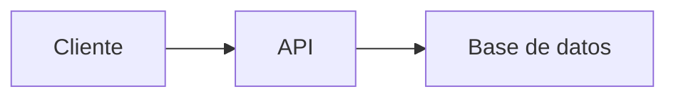

# 📚 Estudio de Roles Básicos en Desarrollo Web y Móvil

##  Recurso Usen el Link odicial para aprender git /github Todos 
https://docs.github.com/es/get-started/start-your-journey/git-and-github-learning-resources
## 0) Integrantes del equipo de estudio y sus responsabilidades en el repositorio *(actualizar)*

0. José Jiménez - josej@unsa.edu.pe  
1. Luis  
2. Pedro  
3. María  
...  
12. 

## 1) Conceptos Generales para tener en cuenta
En el contexto de desarrollo web y móvil: diferencias entre librerías, frameworks y patrones de diseño.

## 2) Conociendo Git
Describiremos cómo nos sirve localmente para poder versionar nuestro software.

## 3) Conociendo Github  
- Describiendo el uso de repositorio remoto  
- Cómo definimos repositorio  
- Cómo configurar para permitir al equipo colaborar  
- Supervisión de posibles conflictos  

### Temas a desarrollar por los miembros del Equipo:  
**Roles básicos en el desarrollo de aplicaciones web y aplicación móvil**

## 4) Desarrollador Frontend
- Descripción del rol  
- Habilidades requeridas  
- Relación con roles de backend, QA, Desarrollador Android  
- Stack tecnológico:  
  - Lenguajes  
  - Frameworks  

## 5) Links recomendados para capacitación Rol Frontend
*(Separados por criterios)*  
🔹 **Sin certificaciones**:  
🔹 **Con certificación**:  
🔹 **Proyectos completos de ejemplo**:  
🔹 **Recomendadas por líderes (Microsoft, AWS, Google)**:  

## 6) Desarrollador Backend
*(Estructura similar a Frontend)*

## 7) Links recomendados para capacitación Rol Backend

## 8) Rol QA

## 9) Links recomendados para capacitación Rol QA

## 10) Desarrollador Android

## 11) Links recomendados para capacitación Rol Android

## 12) Pasos a Desarrollar  
1. **Integrante 0** crea repositorio remoto: `EstudioRolesBasicos`  
2. Compartir el repositorio con compañeros:  
   - Ir a Settings ⚙️ > Collaborators  
   - Invitar usando nombre de usuario GitHub o email registrado  
3. **Compañeros invitados**:  
   - Recibirán invitación por email  
   - Clonar repositorio:  
     ```bash
     cd practica
     git clone https://github.com/jjuarez29/EstudioRolesBasicos
     cd EstudioRolesBasicos
     ```
   - Ver contenido con `dir` (Windows) o `ls` (Linux/Mac)
ejemplo de link
https://github.com/jjuarez29/PYTHON01/settings

## Conociendo algo de mermaid y markdown
**Mermaid** y **Markdown** son herramientas complementarias pero con propósitos diferentes. Aquí te explico sus diferencias y similitudes:

---

### 🔹 **Markdown** (`.md`)
Es un **lenguaje de marcado ligero** para formatear texto plano de manera sencilla, que se convierte en HTML.

**Características**:
1. **Sintaxis simple**: Usa símbolos como `#`, `*`, `>` para títulos, listas, citas, etc.
   ```markdown
   # Título
   - Lista
   **negrita**
   ```
2. **Propósito principal**: Documentación legible en repositorios (como `README.md`).
3. **Soporte nativo en GitHub/GitLab**: Se renderiza automáticamente.
4. **No es programable**: Solo estructura texto e imágenes.

---

### 🔹 **Mermaid**
Es una **librería de diagramación** que permite crear gráficos mediante código dentro de documentos Markdown.

**Características**:
1. **Sintaxis específica**: Usa bloques de código con la etiqueta `mermaid`.
   ````markdown
   ```mermaid
   graph TD
     A[Inicio] --> B{Decisión}
     B -->|Sí| C[OK]
     B -->|No| D[Error]
   ```
   ````
2. **Propósito principal**: Generar diagramas (flujos, UML, Gantt, etc.) sin herramientas externas.
3. **Requiere soporte**: Funciona en GitHub/GitLab con renderizadores compatibles (no en todos lados).
4. **Es programable**: Permite lógica para estructurar gráficos.

---

### 🔄 **Similitudes**
1. **Ambos usan texto plano**: Son legibles sin renderizar.
2. **Se integran en `.md`**: Mermaid vive dentro de bloques de código en Markdown.
3. **Uso en documentación**: Ideales para repositorios y wikis.

---

### 📌 **Diferencias clave**
| Característica       | Markdown                          | Mermaid                          |
|----------------------|-----------------------------------|----------------------------------|
| **Función**          | Formatear texto                   | Crear diagramas                  |
| **Sintaxis**         | `# Título`, `- lista`             | `graph TD`, `pie chart`          |
| **Renderizado**      | Soporte universal                 | Requiere compatibilidad          |
| **Ejemplo**          | Hacer listas o tablas             | Hacer flujogramas o secuencias   |

---

### 🛠 **Ejemplo combinado (Markdown + Mermaid)**
````markdown
# Documentación del Proyecto

## 📊 Diagrama de flujo


## 📝 Pasos
1. Ejecutar `npm install`
2. Abrir `index.html`
````

---

### ✅ **¿Cuándo usar cada uno?**
- **Usa Markdown** para:  
  READMEs, documentación, wikis, notas simples.  
- **Usa Mermaid** para:  
  Diagramas técnicos, arquitectura, flujos de trabajo.  

**Nota**: GitHub soporta ambos, pero verifica si tu plataforma (como Slack o GitLab) también renderiza Mermaid.